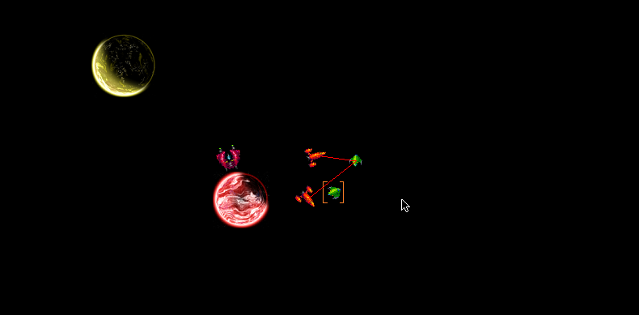

# pygame-udyam

My submission for Udyam 2017 event as is.
I made this game within the duration of a week as I learnt python for the first time so do forgive the quality of code.
The entrypoint is main.py. Do ensure that you have installed the python library pygame before running.

